# Ecommerce Multivendor Project
## 1.Giao diện cho Customer
## 1.1. Trang chủ
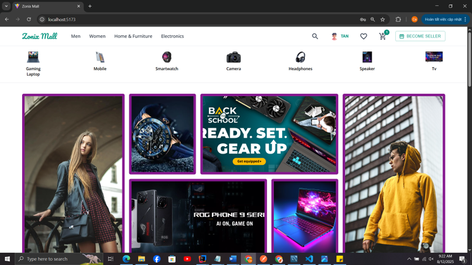

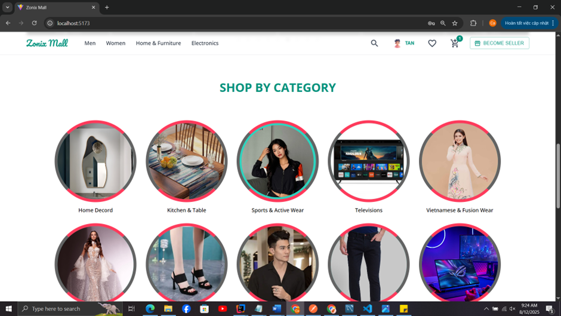

## 1.2. Xem thông tin sản phẩm

## 1.3. Giỏ hàng, đặt hàng , thanh toán
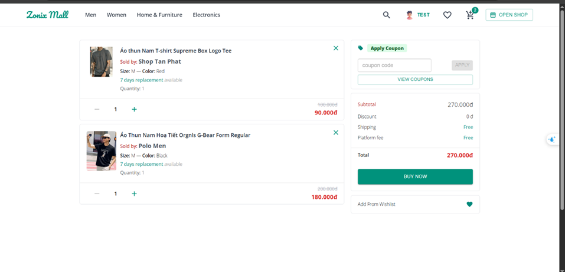
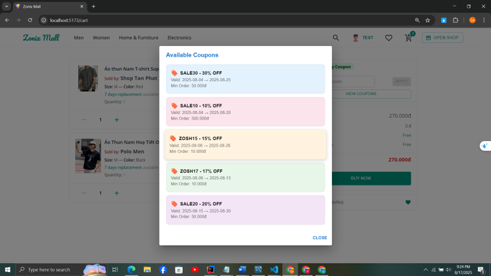
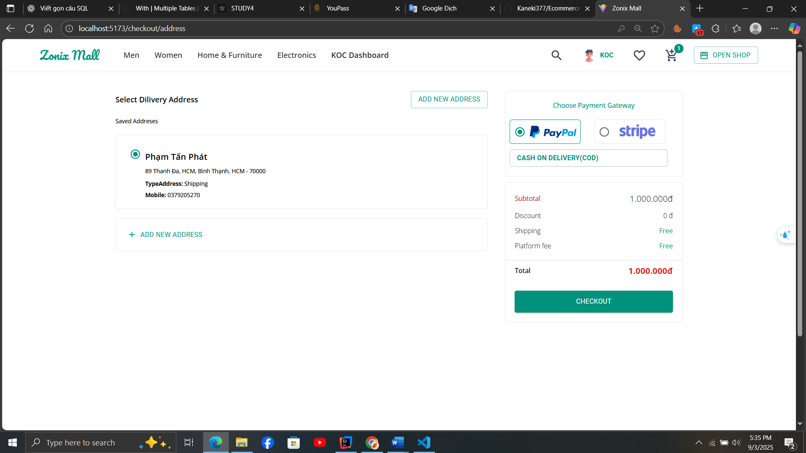

## 1.4. Xem đơn hàng
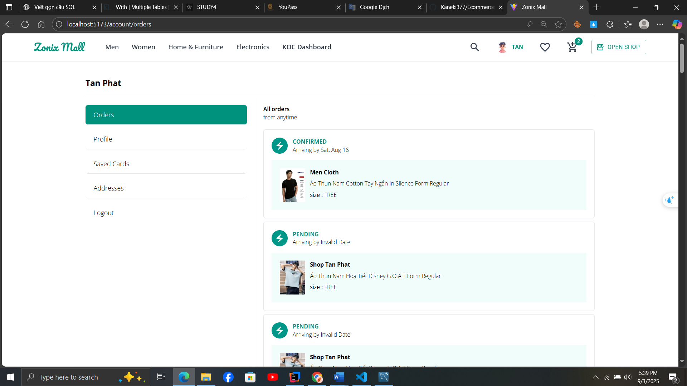
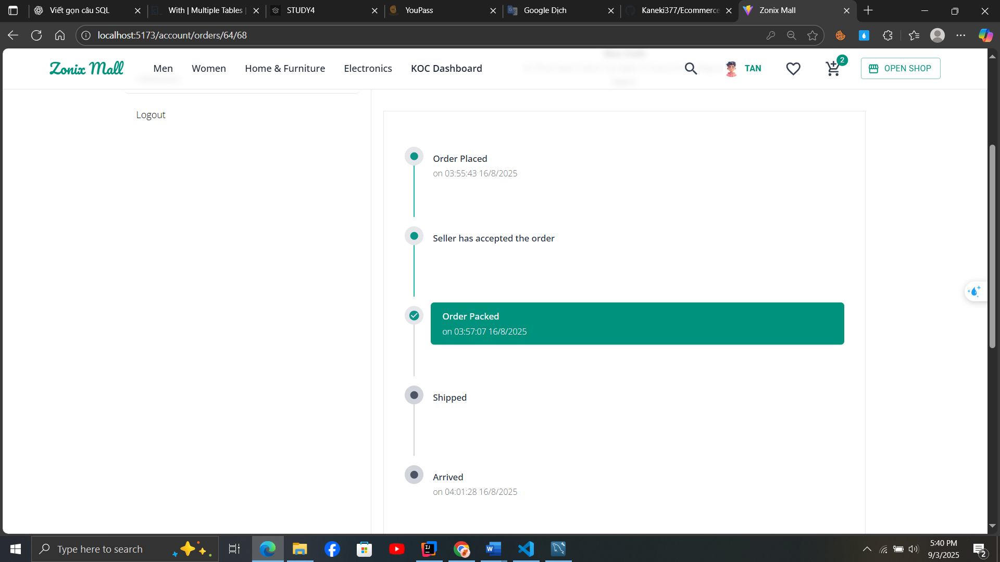

## 1.5. Đăng ký làm KOC

## 2.Giao diện cho Seller
## 2.1.Đăng ký làm Seller

## 2.2.Trang chủ Seller

## 2.3.Xem đơn hàng , thêm sản phẩm , giao dịch của Seller

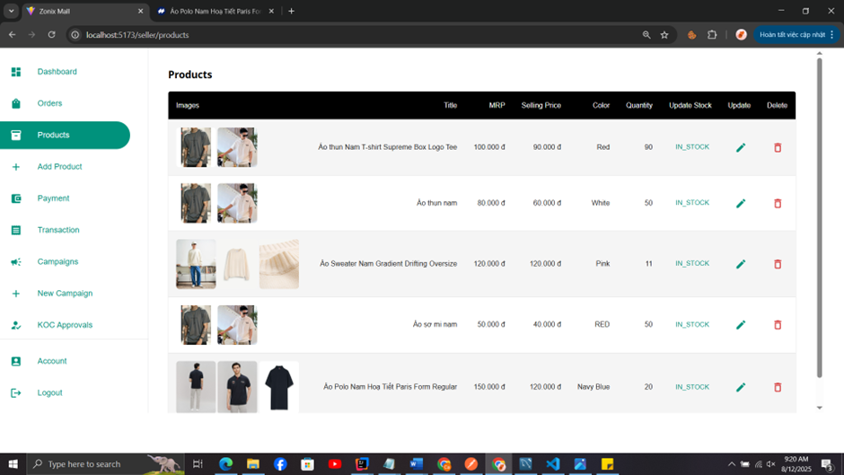
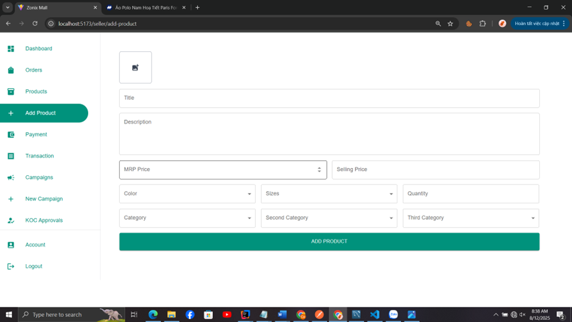
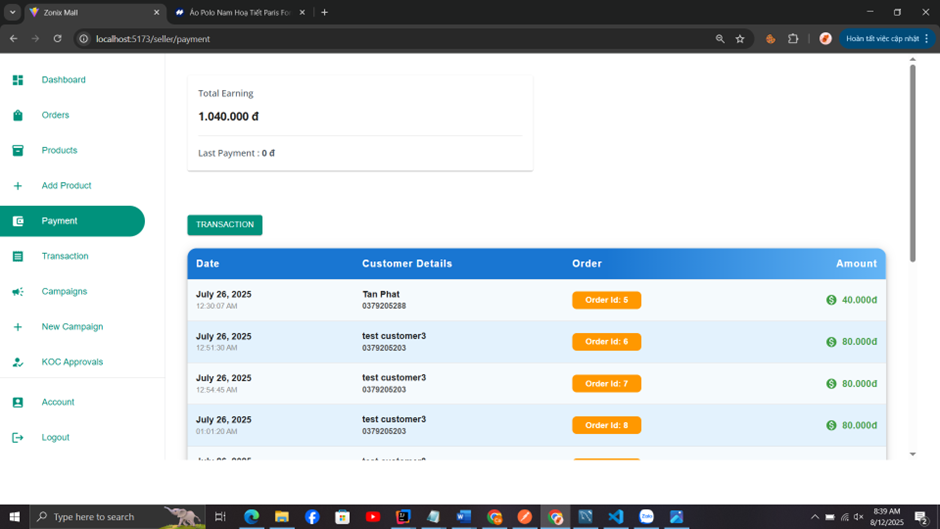

## 2.3.Xem xóa sửa chiến dịch  của Seller
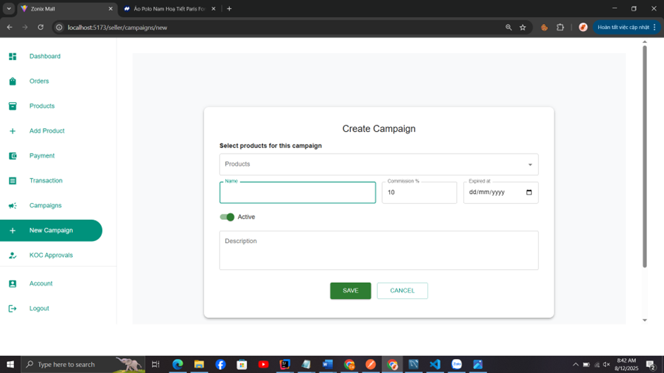

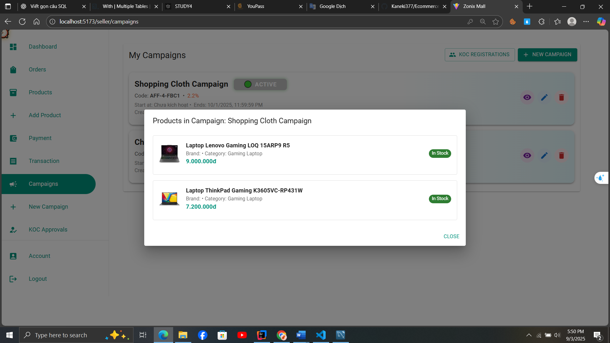

## 2.4.Duyệt KOC tham gia chiến dịch của Seller
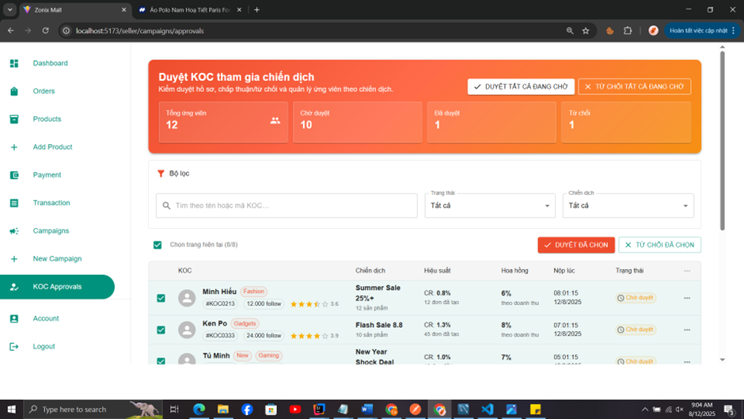

## 3.Giao diện cho Manager
## 3.1.Giao diện quản lý Seller
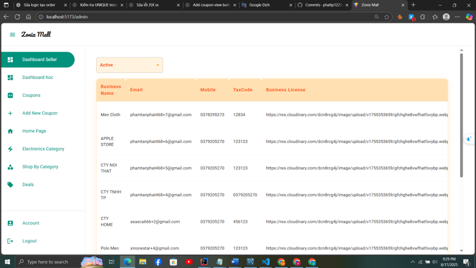
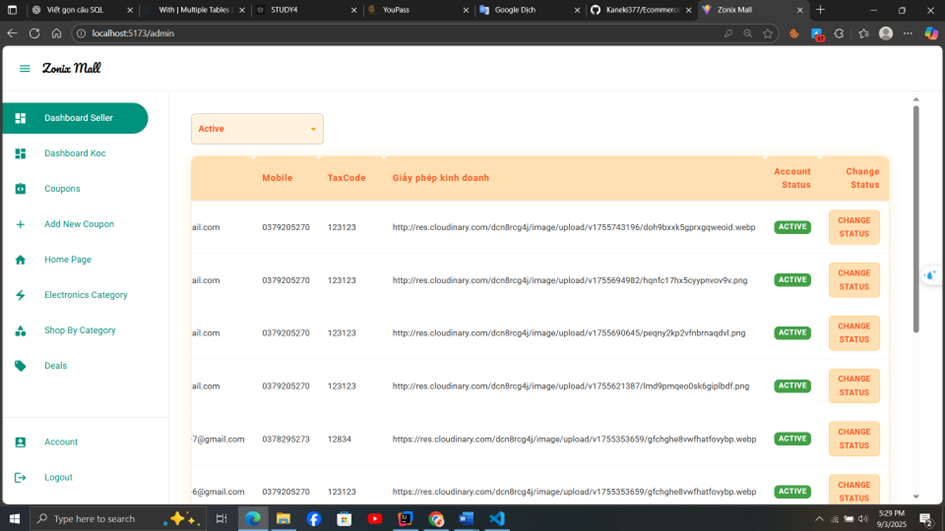
## 3.2.Giao diện quản lý Koc

## 3.3.Giao diện quản lý các mã coupon 

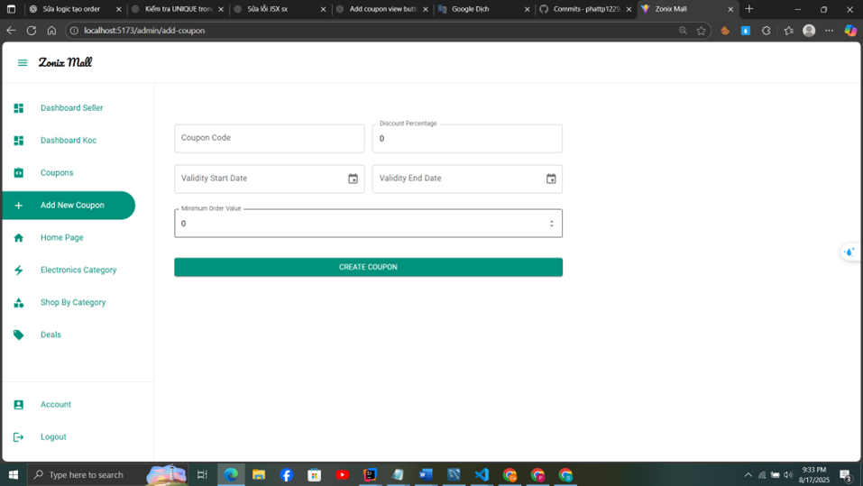

## 4.Giao diện cho Koc
## 4.1.Giao diện trang chủ của Koc

## 4.2.Giao diện xem các chiến dịch cua Koc
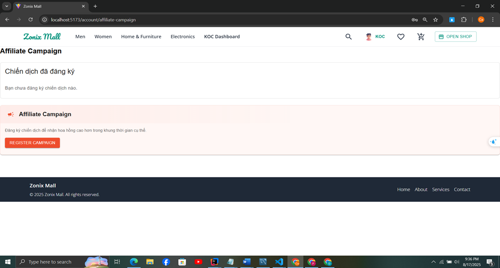

## 4.3.Giao diện xem các link sản phẩm khi Koc được duyệt vô chiến dịch
